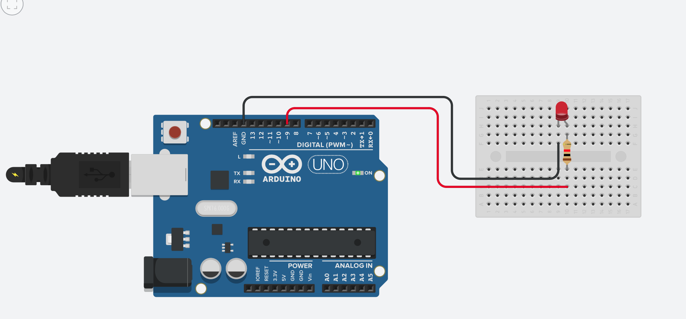
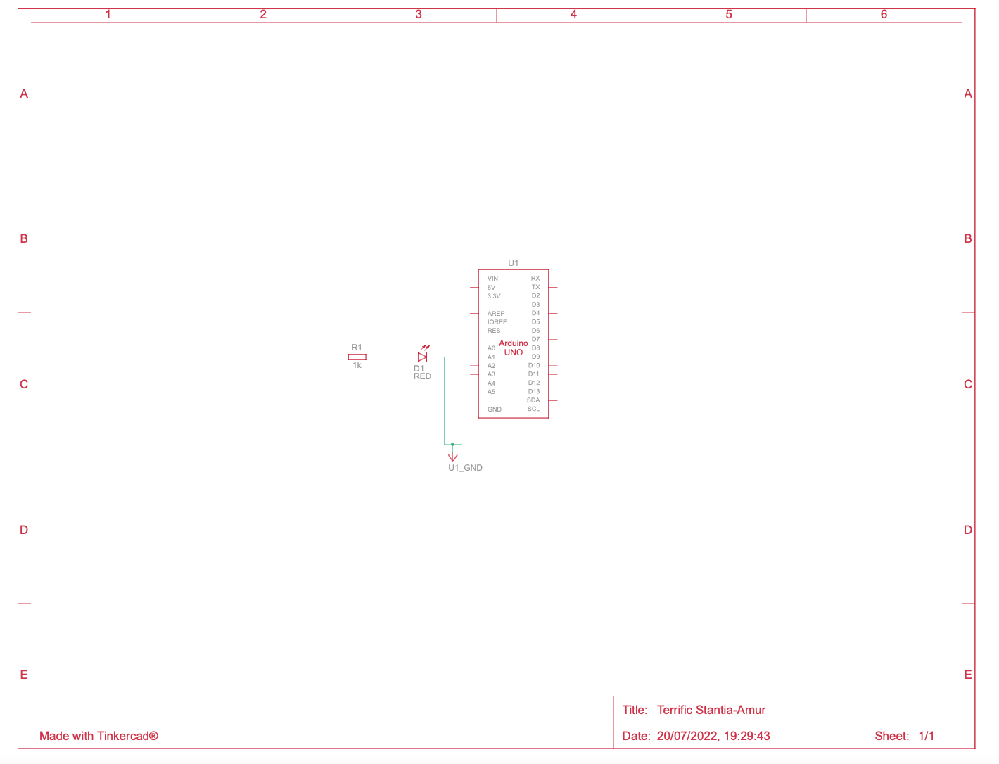

# Led Arduino 

## Who madde this :
Made with ❤️ by Max21910 in 🇫🇷
## Description
An simple arduino program  to flash a led with a delay of 2s

## How to use it ?
no library needed.

## Free to use ?
yes this project is open source !
## Image : 

